<div align="center">



<br/>

<a href="https://github.com/rajat00-star"></a>
<a href="https://www.linkedin.com/in/YOUR-LINKEDIN-USERNAME"></a>
<a href="https://leetcode.com/u/YOUR-LEETCODE-USERNAME/"></a>
<a href="mailto:sangerrajat0@gmail.com"></a>

</div>


<div align="center">


</div>


## ⚡ ULTRAMATRIX

<div align="center">

**AI / ML project — active development**


</div>

### Honest system status

The core above shows the **intended** shape of the system. Here is what is and isn't real today:

| State | What that means | UltraMatrix today |
|---|---|---|
| 🟢 **IMPLEMENTED** | In a commit you can read | *Nothing published yet — the repository is not public.* |
| 🟣 **EXPERIMENTAL** | Being tried, may be discarded | Architecture and stack decisions: Python for the AI/ML layer, TypeScript across application code |
| ⚪ **PLANNED** | Intended, not started | Public repository, documented setup, a demo once there is something worth demoing |

> No accuracy figures, benchmarks, users, models, or deployments are claimed here — **none exist yet.** This table gets rewritten with real numbers when there are real numbers to write.


## 🧠 ULTRAMATRIX ARCHITECTURE

<div align="center">


<sub>Colour encodes layer — <b><code>violet</code></b> AI/ML · <b><code>blue</code></b> frontend · <b><code>green</code></b> backend · <b><code>amber</code></b> shared language</sub>

</div>


## 🚀 PROJECT MISSIONS

<div align="center">

`🟢 ACTIVE` public and working &nbsp;·&nbsp; `🟡 DEVELOPMENT` being built now &nbsp;·&nbsp; `🟣 EXPERIMENTAL` being tried &nbsp;·&nbsp; `⚪ PLANNED` not started

</div>

<br/>

### 🟢 Hand Tracking Using OpenCV

Real-time hand tracking and gesture recognition from a webcam feed — hand landmark detection for gesture-based human-computer interaction.

<div align="center">
<a href="https://github.com/rajat00-star/Hand-Tracking-Using-OpenCV">
  
</a>
</div>

| | |
|---|---|
| **Status** | 🟢 ACTIVE — public, MIT licensed |
| **Constellation** | `Python` · `OpenCV` · `Computer Vision` |
| **Concepts** | Landmark detection · real-time video processing · frame-by-frame tracking |
| **Repository** | [Hand-Tracking-Using-OpenCV](https://github.com/rajat00-star/Hand-Tracking-Using-OpenCV) |

<br/>

### 🟡 UltraMatrix

Primary AI/ML project. Architecture and honest status are in the section above.

| | |
|---|---|
| **Status** | 🟡 DEVELOPMENT — repository not yet public |
| **Constellation** | `Python` · `TypeScript` · `React` · `Next.js` · `Tailwind` · `Node.js` · `Express` |
| **Repository** | Coming soon |

<br/>

### ⚪ CodeForage

Intended direction: AI-assisted software engineering tooling. Nothing is built yet, so nothing is claimed yet.

| | |
|---|---|
| **Status** | ⚪ PLANNED — repository not yet public |
| **Constellation** | `Python` · `AI/ML` |
| **Repository** | Coming soon |

<!--
  When UltraMatrix or CodeForage go public: copy the pin card from the
  Hand-Tracking section, swap repo= for the exact repository name, and change
  the status row. Do not add a pin card for a repo that does not exist —
  it renders a red "Repository not found" box on your profile.
-->


## 🧠 DSA MISSION CONTROL

<div align="center">


<br/>


</div>

Solutions live in a dedicated repository organised **by pattern, not by problem number** — the pattern is the part worth remembering:

```text
DSA-Cpp/
├── Arrays/          ├── BinarySearch/
├── Strings/         ├── LinkedList/
├── Hashing/         ├── Trees/
├── TwoPointers/     ├── Heap/
├── SlidingWindow/   ├── Graphs/
├── Stack/           ├── Greedy/
└── Queue/           └── DynamicProgramming/
```


## 🤖 AI / ML ORBITAL ROADMAP

<div align="center">


</div>


## 🛰️ TECHNOLOGY CONSTELLATION

<div align="center">


</div>


## 📊 GITHUB TELEMETRY

<div align="center">


<br/><br/>


</div>

### Building consistently

<div align="center">


<sub><i>Consistency compounds. Contribution count is not a measure of engineering ability — it is a measure of showing up.</i></sub>

</div>


## 🐍 CONTRIBUTION ORBIT

<div align="center">

<picture>
  <source media="(prefers-color-scheme: dark)" srcset="https://raw.githubusercontent.com/rajat00-star/rajat00-star/output/github-contribution-grid-snake-nebula.svg" />
  <source media="(prefers-color-scheme: light)" srcset="https://raw.githubusercontent.com/rajat00-star/rajat00-star/output/github-contribution-grid-snake.svg" />
  
</picture>

<sub><i>Generated daily by GitHub Actions from real contribution data. Nothing here is synthetic.</i></sub>

</div>


## 🏆 CREDENTIALS & LEARNING

Completion credentials and job simulations — listed as **learning experiences**, not professional certifications.

<div align="center">


</div>


## ⚙️ ENGINEERING PRINCIPLES

<div align="center">


</div>


## 🚀 2026 FLIGHT PLAN

<div align="center">


<sub>These are <b>goals</b>. None of them are claimed as achieved.</sub>

</div>


## 💻 ONBOARD TERMINAL

<div align="center">


</div>


## 🌠 CONNECT

<div align="center">

### Have an interesting problem? Let's build something.

<a href="https://github.com/rajat00-star"></a>
<a href="https://www.linkedin.com/in/YOUR-LINKEDIN-USERNAME"></a>
<a href="https://leetcode.com/u/YOUR-LEETCODE-USERNAME/"></a>
<a href="mailto:sangerrajat0@gmail.com"></a>

<br/>

<sub>Open to internships, open-source collaboration and engineering opportunities.</sub>

<br/>


</div>


